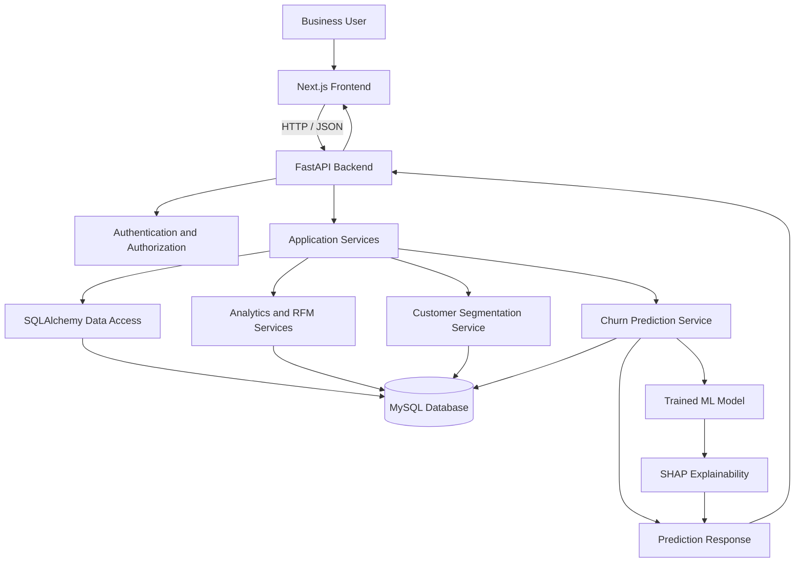
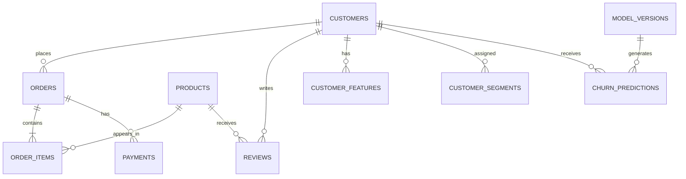
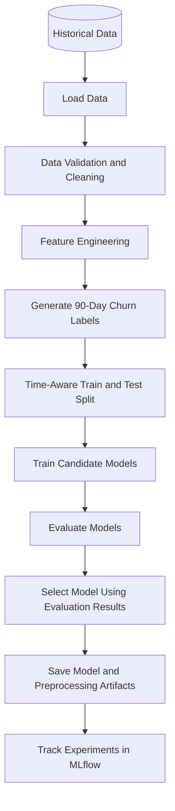
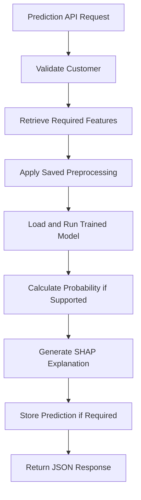
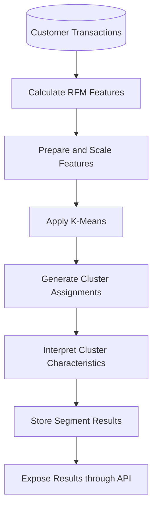
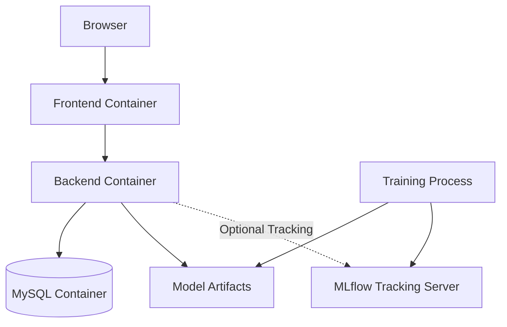

# RetainIQ — System Architecture

## 1. Introduction

### 1.1 Purpose

This document describes the system architecture of RetainIQ, an E-Commerce Customer Intelligence and Churn Prediction Platform.

It explains the major system components, their responsibilities, communication flow, data flow, machine learning architecture, and deployment structure.

### 1.2 Architecture Goals

The architecture is designed to:

- Separate frontend, backend, database, and machine learning responsibilities.
- Provide REST APIs for communication between the frontend and backend.
- Store application and e-commerce data in MySQL.
- Support customer analytics and segmentation.
- Generate machine learning-based churn predictions.
- Explain predictions using SHAP.
- Make the application maintainable, testable, and extensible.
- Support local development and deployment using Docker.

## 2. Technology Stack

| Layer | Technology | Responsibility |
|---|---|---|
| Frontend | Next.js | User interface and application pages |
| Programming Language | TypeScript | Frontend type safety |
| UI Styling | Tailwind CSS | Styling and responsive layouts |
| UI Components | shadcn/ui | Reusable interface components |
| Backend | FastAPI | REST API and application logic |
| Backend Language | Python | Business logic and ML integration |
| Database | MySQL | Persistent application and business data |
| ORM | SQLAlchemy | Database access and object mapping |
| Migrations | Alembic | Database schema versioning |
| Data Processing | Pandas, NumPy | Data cleaning and feature engineering |
| Machine Learning | Scikit-learn, XGBoost | Segmentation and churn prediction |
| Explainability | SHAP | Feature contribution explanations |
| Backend Testing | Pytest | Unit and API tests |
| Frontend Testing | Playwright | Browser-based workflow tests |
| Containers | Docker | Consistent service environments |
| Orchestration | Docker Compose | Local multi-service setup |
| CI/CD | GitHub Actions | Automated testing and build workflows |
| ML Tracking | MLflow | Experiment tracking and model metadata |

## 3. High-Level Architecture

RetainIQ follows a layered architecture.



### Architecture Overview

The frontend communicates with the backend through HTTP requests and JSON responses.

The backend validates requests, executes application logic, and accesses MySQL through SQLAlchemy.

Analytics and machine learning services process customer and transaction data. Churn prediction uses a trained model, while SHAP generates explanations for supported predictions.

The backend returns the results to the frontend, where users can explore analytics and customer information.

## 4. Architectural Layers

### 4.1 Presentation Layer

**Technology:** Next.js, TypeScript, Tailwind CSS, shadcn/ui

The presentation layer provides the interface used by business users.

Responsibilities:

- Render the dashboard.
- Display revenue and customer analytics.
- Show customer profiles and purchase history.
- Display customer segments.
- Display churn predictions and risk categories.
- Present SHAP explanations.
- Collect user input for searching and filtering.
- Communicate with FastAPI endpoints.

Planned frontend pages:

- Login
- Dashboard
- Customers
- Customer Details
- Products
- Orders
- Segments
- Churn
- Analytics

The frontend should not connect directly to MySQL or contain machine learning business logic.

### 4.2 API Layer

**Technology:** FastAPI

The API layer provides endpoints through which the frontend accesses backend functionality.

Responsibilities:

- Receive HTTP requests.
- Validate request parameters and payloads.
- Apply authentication and authorization where required.
- Call application services.
- Return JSON responses.
- Handle expected application errors.
- Use appropriate HTTP status codes.

Example endpoint:

`GET /api/v1/analytics/overview`

This endpoint returns summary information required by the dashboard.

### 4.3 Application Service Layer

The service layer contains the main business logic.

Planned services include:

**Analytics Service**
- Calculate revenue and order metrics.
- Aggregate customer statistics.
- Prepare dashboard data.

**Customer Service**
- Retrieve customer information.
- Retrieve purchase history.
- Provide customer-related analytics.

**RFM Service**
- Calculate recency, frequency, and monetary values.
- Prepare customer-level features.

**Segmentation Service**
- Prepare segmentation features.
- Apply the trained K-Means model.
- Assign cluster identifiers.
- Map clusters to documented business labels.

**Churn Prediction Service**
- Retrieve or prepare customer features.
- Load the appropriate trained model.
- Generate churn predictions.
- Store prediction records when required.

**Explainability Service**
- Calculate SHAP values where supported.
- Prepare feature contribution information.
- Return explanation data for the frontend.

Services should contain reusable business logic rather than duplicating it across API route handlers.

### 4.4 Data Access Layer

**Technology:** SQLAlchemy

The data access layer manages communication between backend services and MySQL.

Responsibilities:

- Define and use database models.
- Create, retrieve, update, and delete records where permitted.
- Execute database queries.
- Manage database sessions and transactions.
- Support consistent database access patterns.

The API layer should not contain large amounts of raw SQL or database-specific business logic.

### 4.5 Database Layer

**Technology:** MySQL

The database stores application data, e-commerce records, analytical features, and prediction results.

Planned tables:

- `users`
- `customers`
- `products`
- `orders`
- `order_items`
- `payments`
- `reviews`
- `customer_features`
- `customer_segments`
- `churn_predictions`
- `model_versions`

The final schema and relationships will be defined in `database-design.md`.

Alembic will manage schema changes through version-controlled migrations.

### 4.6 Machine Learning Layer

**Technology:** Pandas, NumPy, Scikit-learn, XGBoost, SHAP

The machine learning layer supports customer segmentation and churn prediction.

Responsibilities:

- Prepare historical data.
- Clean and transform features.
- Calculate customer-level features.
- Train and evaluate candidate models.
- Generate predictions.
- Explain model outputs.
- Track model versions and evaluation results.

Model training should be separated from normal prediction requests wherever practical. A trained model can be loaded by the prediction service without retraining it for every API request.

## 5. Frontend Architecture

The frontend will use the Next.js App Router and reusable React components.

Proposed structure:

```text
frontend/
├── app/
│   ├── login/
│   │   └── page.tsx
│   ├── dashboard/
│   │   └── page.tsx
│   ├── customers/
│   │   ├── page.tsx
│   │   └── [customerId]/
│   │       └── page.tsx
│   ├── products/
│   │   └── page.tsx
│   ├── orders/
│   │   └── page.tsx
│   ├── segments/
│   │   └── page.tsx
│   ├── churn/
│   │   └── page.tsx
│   ├── analytics/
│   │   └── page.tsx
│   ├── layout.tsx
│   └── page.tsx
├── components/
│   ├── ui/
│   ├── layout/
│   ├── dashboard/
│   ├── customers/
│   ├── charts/
│   └── tables/
├── lib/
│   ├── api.ts
│   └── utils.ts
├── hooks/
├── types/
└── public/
```

### Frontend Communication

The frontend API client will send requests to the FastAPI backend.

Example:

```typescript
const response = await fetch(
  `${process.env.NEXT_PUBLIC_API_URL}/api/v1/analytics/overview`
);

if (!response.ok) {
  throw new Error("Failed to load dashboard analytics");
}

const data = await response.json();
```

The API base URL should be configured through environment variables.

Protected requests must include the application's chosen authentication mechanism. The final implementation must also handle loading states, errors, and unauthorized responses.

## 6. Backend Architecture

The backend will use FastAPI with modular routes, schemas, services, models, and database configuration.

Proposed structure:

```text
backend/
├── app/
│   ├── main.py
│   ├── api/
│   │   ├── deps.py
│   │   └── v1/
│   │       ├── router.py
│   │       └── endpoints/
│   │           ├── auth.py
│   │           ├── analytics.py
│   │           ├── customers.py
│   │           ├── products.py
│   │           ├── orders.py
│   │           ├── segments.py
│   │           └── predictions.py
│   ├── core/
│   │   ├── config.py
│   │   └── security.py
│   ├── db/
│   │   ├── session.py
│   │   └── base.py
│   ├── models/
│   ├── schemas/
│   ├── services/
│   │   ├── analytics_service.py
│   │   ├── customer_service.py
│   │   ├── rfm_service.py
│   │   ├── segmentation_service.py
│   │   ├── churn_service.py
│   │   └── explainability_service.py
│   └── ml/
│       ├── preprocessing.py
│       ├── train.py
│       ├── predict.py
│       └── model_loader.py
├── tests/
├── alembic/
├── alembic.ini
├── requirements.txt
└── Dockerfile
```

This is a proposed structure. Files can be introduced incrementally as their features are implemented.

### Request Processing Flow

1. A request reaches a FastAPI endpoint.
2. The endpoint validates the request.
3. Dependencies provide required database sessions or authenticated user information.
4. The endpoint calls the relevant service.
5. The service performs business logic and accesses the database or machine learning components.
6. The endpoint returns a validated response.

## 7. Database Architecture

MySQL will act as the persistent data store.

### Main Relationships



These relationships are conceptual. Exact cardinalities and constraints will depend on the final schema and business rules.

### Data Management Principles

- Use primary keys to identify records.
- Use foreign keys for valid relationships.
- Use appropriate indexes for frequently queried fields.
- Use Alembic migrations for schema changes.
- Validate transaction values before analytics.
- Define consistent handling for cancelled orders and refunds.
- Store timestamps consistently.
- Avoid storing unnecessary personal information.
- Use transactions for operations that require atomic updates.

## 8. Machine Learning Architecture

The machine learning workflow consists of an offline training pipeline and an online prediction workflow.

### 8.1 Training Pipeline



Training responsibilities:

1. Load eligible historical data.
2. Validate and clean records.
3. Generate customer features.
4. Generate churn labels based on the defined 90-day outcome window.
5. Split data using a methodology appropriate for the prediction timeline.
6. Train Logistic Regression, Random Forest, and XGBoost candidates.
7. Evaluate Precision, Recall, F1-score, ROC-AUC, PR-AUC, and the confusion matrix.
8. Save the selected model and its preprocessing artifacts.
9. Record experiment information in MLflow.

The training pipeline must prevent target leakage. Features must only use information available at the prediction reference date, and the future label window must be observed before the label is finalized.

### 8.2 Prediction Workflow



The prediction service should use the same feature definitions and preprocessing logic used during training.

A prediction response may include:

- Customer ID
- Churn prediction
- Churn probability, if supported
- Risk category based on configured thresholds
- Model version
- Prediction timestamp
- Explanation summary, when available

Risk thresholds must be documented and validated. A predicted probability is an estimate, not a guarantee of future customer behavior.

### 8.3 Customer Segmentation Workflow



K-Means cluster identifiers are mathematical labels, not predefined business categories. Business names such as Champions or At Risk must be assigned using documented rules based on measured cluster characteristics.

## 9. API Architecture

All application APIs will be versioned under:

`/api/v1`

### Planned Endpoints

| Method | Endpoint | Responsibility |
|---|---|---|
| GET | `/api/v1/analytics/overview` | Dashboard summary |
| GET | `/api/v1/analytics/revenue` | Revenue analytics |
| GET | `/api/v1/analytics/customers` | Customer analytics |
| GET | `/api/v1/analytics/segments` | Segment analytics |
| GET | `/api/v1/analytics/churn` | Churn analytics |
| GET | `/api/v1/customers` | Customer list |
| GET | `/api/v1/customers/{customer_id}` | Customer details |
| GET | `/api/v1/products` | Product list |
| GET | `/api/v1/orders` | Order list |
| POST | `/api/v1/predictions/churn/{customer_id}` | Generate churn prediction |

These are planned routes and may be adjusted as the API schemas are finalized.

### API Design Principles

- Use appropriate HTTP methods.
- Validate query parameters and request bodies.
- Return consistent JSON structures.
- Use pagination for large collections.
- Apply authentication and authorization to protected routes.
- Return meaningful HTTP status codes.
- Avoid exposing internal errors or sensitive information.
- Document APIs using FastAPI's OpenAPI support.

## 10. Security Architecture

Security controls will be applied across the application.

### Authentication

- Authenticate users before granting access to protected functionality.
- Store passwords using a suitable password-hashing algorithm.
- Define an appropriate session or token strategy.
- Protect authentication credentials in transit.

### Authorization

- Restrict protected API endpoints to authorized users.
- Enforce role-based permissions if multiple user roles are implemented.
- Do not rely solely on frontend route protection.

### Configuration and Secrets

- Use environment variables for secrets and environment-specific configuration.
- Do not commit real credentials to Git.
- Use separate configurations for development and production.
- Restrict database access to authorized application services.

### Input and Data Security

- Validate and constrain incoming requests.
- Use ORM parameterization or safe parameterized queries.
- Avoid exposing passwords, tokens, or unnecessary personal information in logs.
- Use HTTPS in production.
- Define backup and recovery procedures for important data.

## 11. Error Handling and Observability

The application should handle errors consistently.

### Error Handling

Examples include:

- Invalid request: return an appropriate 4xx response.
- Unauthenticated request: return `401 Unauthorized` when appropriate.
- Forbidden operation: return `403 Forbidden` when appropriate.
- Unknown customer: return `404 Not Found`.
- Database failure: return a controlled server error.
- Missing model artifact: return a controlled prediction-service error.

Detailed internal exception messages and sensitive data must not be exposed to end users.

### Logging

Application logs should help diagnose issues involving:

- API requests and failures.
- Database operations.
- Model loading and prediction errors.
- Training and evaluation jobs.
- Application startup and shutdown.

Logs should avoid recording passwords, tokens, and unnecessary personal data.

### Health Checks

The backend should expose a health endpoint, such as:

`GET /health`

A separate readiness check may verify whether essential dependencies, such as the database, are available.

Health checks should report service status without disclosing secrets or internal configuration.

## 12. Deployment Architecture

Docker Compose will be used to run the initial application services locally.



### Planned Services

**Frontend**
- Runs the Next.js application.
- Communicates with FastAPI.
- Uses environment-specific configuration.

**Backend**
- Runs the FastAPI application.
- Connects to MySQL.
- Loads trained model artifacts.
- Exposes API and health endpoints.

**MySQL**
- Stores application and business data.
- Uses a persistent volume.
- Supports health checks.

**MLflow**
- Tracks experiments and model metadata when introduced.
- Requires suitable persistent storage and configuration.

### Deployment Principles

- Keep application configuration outside source code.
- Persist database data using Docker volumes.
- Configure service startup and health checks.
- Avoid exposing database ports publicly in production unless required.
- Use managed secrets and appropriate network controls in production.
- Run database migrations through a controlled process.

## 13. Testing Architecture

### Backend

Use Pytest for:

- Service-level unit tests.
- API endpoint tests.
- Data validation tests.
- Database integration tests.
- RFM and segmentation tests.
- Machine learning preprocessing and prediction tests.
- Error-handling tests.

### Frontend

Use Playwright for:

- Login workflows.
- Dashboard loading.
- Customer search and details.
- Navigation between pages.
- Segment exploration.
- Viewing churn predictions.

### Machine Learning

Test:

- Feature consistency between training and prediction.
- Churn label generation.
- Data leakage prevention.
- Model loading.
- Prediction response structure.
- Evaluation metric calculations.
- SHAP output handling for supported models.

### Continuous Integration

GitHub Actions should run applicable linting, testing, and build workflows when changes are submitted.

## 14. Development Phases

The system should be developed incrementally.

### Phase 1: Project Foundation

- Create the frontend and backend applications.
- Configure environment variables.
- Configure MySQL and SQLAlchemy.
- Set up Alembic migrations.
- Configure Docker Compose.
- Add basic health checks.

### Phase 2: Core Data and APIs

- Implement database models.
- Create customer, product, order, and transaction APIs.
- Add data validation.
- Add initial automated tests.

### Phase 3: Dashboard and Analytics

- Build the dashboard layout.
- Implement overview and revenue endpoints.
- Display analytics charts.
- Add customer search and details.

### Phase 4: RFM and Segmentation

- Implement RFM calculations.
- Prepare segmentation features.
- Train and apply K-Means.
- Store and display segment results.

### Phase 5: Churn Prediction

- Define the training dataset and churn labels.
- Train and evaluate candidate models.
- Save the selected model and preprocessing artifacts.
- Implement prediction APIs.
- Store and display prediction results.

### Phase 6: Explainability

- Integrate SHAP.
- Generate explanations for supported predictions.
- Display feature contributions on the frontend.

### Phase 7: Testing and Deployment

- Expand backend and frontend tests.
- Configure GitHub Actions.
- Add experiment tracking with MLflow.
- Validate Docker deployment.
- Document setup and operational procedures.

## 15. Architecture Decisions and Constraints

The following decisions guide the initial implementation:

- Next.js is responsible for the user interface.
- FastAPI is responsible for application APIs and backend business logic.
- MySQL is the primary relational database.
- SQLAlchemy manages database access.
- Alembic manages database schema migrations.
- Pandas and NumPy support data processing.
- Scikit-learn and XGBoost support machine learning.
- SHAP supports model explainability.
- MLflow supports experiment tracking.
- Docker Compose supports local multi-service development.

The architecture may evolve as real dataset size, workload, security needs, and deployment requirements become clearer.

## 16. Future Architecture Improvements

Potential future enhancements include:

- Scheduled data ingestion and feature calculation.
- Background workers for long-running training jobs.
- Scheduled model retraining.
- Model and data drift monitoring.
- Customer lifetime value prediction.
- Recommendation services.
- External e-commerce platform integrations.
- Advanced role-based access control.
- Production deployment to cloud infrastructure.
- Centralized metrics, tracing, and alerting.

These enhancements are not required for the initial implementation unless added to the project scope.

## 17. Conclusion

RetainIQ uses a modular architecture that separates presentation, API handling, business logic, data access, persistence, and machine learning.

This separation allows the project to be developed and tested incrementally. It also makes it easier to maintain analytics logic, update trained models, and introduce new features without unnecessarily coupling the frontend, backend, database, and machine learning components.