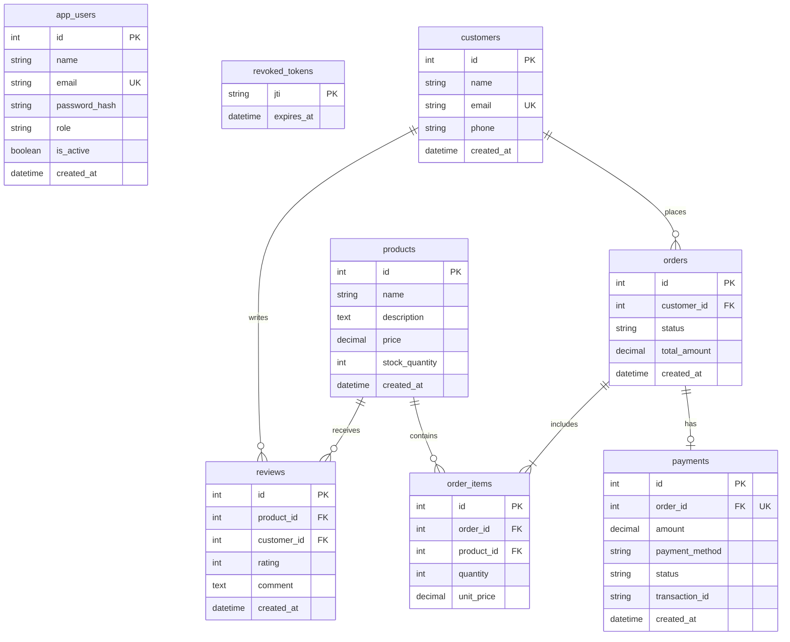

# Database Schema Design

This document provides the Entity-Relationship (ER) diagram for the E-Commerce database designed for the Retain-IQ platform.

## ER Diagram

### Table Relationships

*   **Customer ↔ Order:** One-to-Many (`customers` place multiple `orders`).
*   **Order ↔ OrderItem:** One-to-Many (`orders` contain multiple `order_items`).
*   **Product ↔ OrderItem:** One-to-Many (`products` are part of multiple `order_items`).
*   **Order ↔ Payment:** One-to-One (Each `order` has one specific `payment` record).
*   **Customer ↔ Review:** One-to-Many (`customers` write multiple `reviews`).
*   **Product ↔ Review:** One-to-Many (`products` have multiple `reviews`).
*   **User:** Independent table for platform administrative users.
